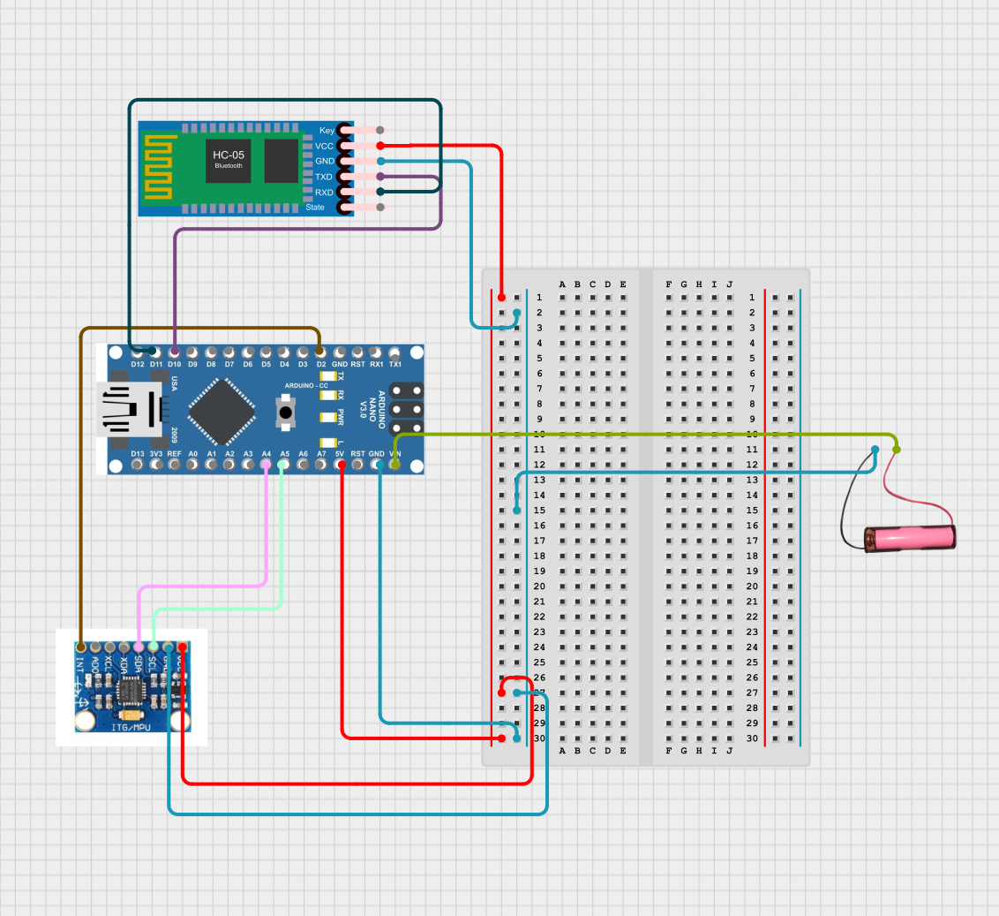
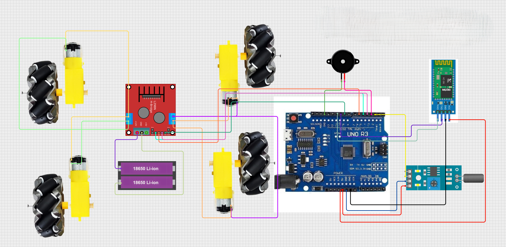

# Gesture-Controlled Wheelchair 🖐️♿

A low-cost gesture-controlled wheelchair designed for people with lower-limb paralysis.  
The system uses a **wrist-mounted controller** and a **wheelchair-mounted receiver**, following a **distributed and fail-safe embedded architecture**.

---

## 📌 Project Overview

- Replaces joystick-based control with wrist gestures  
- Variable speed based on hand tilt  
- Supports diagonal movement  
- Smooth acceleration control  
- Emergency stop on communication failure  
- All safety logic handled on the receiver  

---

## 🧠 System Architecture

### High-Level Block Diagram


The system has two independent units:
- **Wrist Unit (Transmitter)** – sends raw gyro data
- **Wheelchair Unit (Receiver)** – handles control, motion, and safety

---

## 🖐️ Wrist Unit (Transmitter)

- Worn on the wrist
- Uses MPU6050
- Sends raw gyroscope data via Bluetooth
- No control or safety logic



---

## ♿ Wheelchair Unit (Receiver)

- Receives sensor data
- Validates packets (CRC + sequence)
- Computes motion and speed
- Smooth acceleration
- Emergency stop on faults



---

## 📁 Repository Structure

```text
Gesture-controlled-wheelchair/
├── Wrist_Unit/
│   └── Wrist_Unit.ino
│
├── Wheelchair_receiver_code/
│   └── Wheelchair_receiver_code.ino
│
├── ReadMe-Files/
│   ├── FinalReport.pdf
│   ├── Gesture controlled wheelchair demo.jpg
│   ├── Model Schematics.png
│   ├── Wrist_Unit.png
│   └── Chair_Receiver.png
│
└── README.md

```


---

## ⚙️ Hardware Used

- Arduino Uno / Nano  
- MPU6050  
- HC-05 Bluetooth  
- L298N / L293D Motor Driver  
- DC Motors  
- Enable Button  
- Buzzer  

---

## 🛡️ Safety Features

- CRC and sequence validation  
- Communication timeout  
- Manual enable/disable  
- Immediate motor shutdown on fault  

> Absence of valid data is treated as a STOP command.

---

## 📄 Report

📘 Full IEEE-style report:  
[FinalReport.pdf](ReadMe-Files/FinalReport.pdf)

---

## 👥 Contributors

- **Soumya Ray**  
  B.Tech AI & DS, Amrita Vishwa Vidyapeetham, Delhi  

- **Asmit Sarkar**  
  B.Tech, IIT Kharagpur  

---

## 🚀 Future Work

- Fall detection using accelerometer  
- Obstacle avoidance  
- AI-based gesture learning  
- Mobile app control  

---

⭐ If you like this project, feel free to fork and extend it.
---

## © Copyright

© 2025 **Soumya Ray** and **Asmit Sarkar**. All rights reserved.

This project is developed for **academic and educational purposes**.  
Permission is granted to use, modify, and distribute this work **with proper attribution** to the original authors.

Commercial use or redistribution without explicit permission from the authors is **not permitted**.
